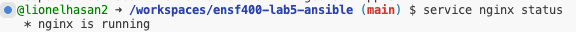
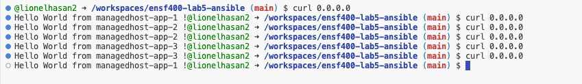

## Option Taken to create load balancer

I took the option of using ansible to install nginx on the localhost to create the load balancer. This can be inspected in the hello.yml playbook. 

This is a screenshot displaying that I sucessfully installed nginx on my localhost:

## Output for curling 0.0.0.0 : Showing that the playbook works as intended:

A different host is accessed each time 0.0.0.0 is curled. 

